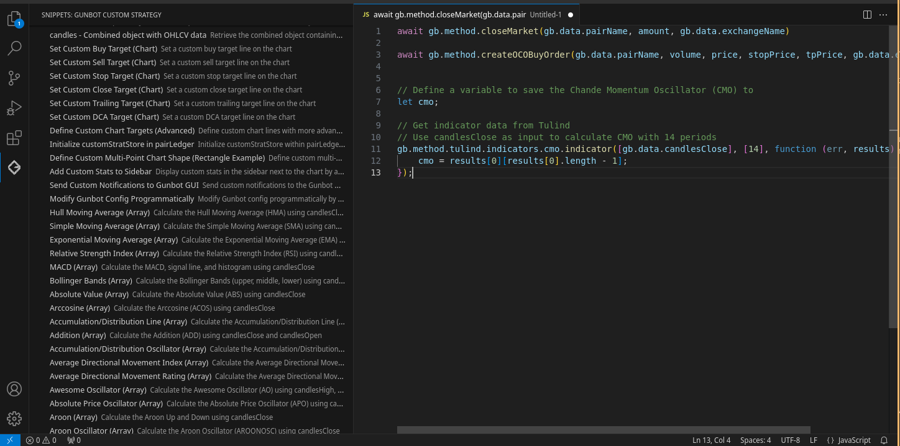
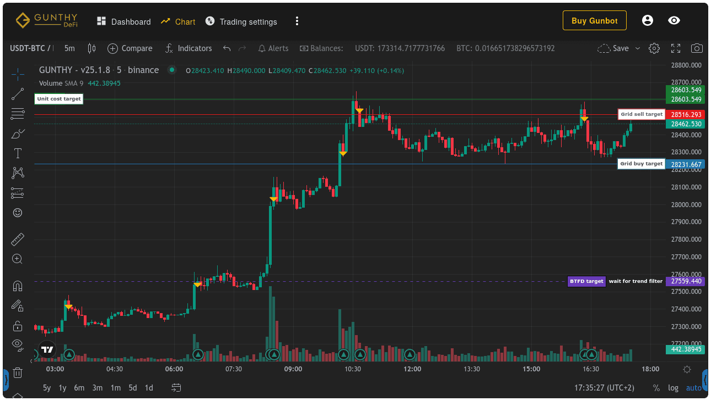

# Gunbot Custom Trading Strategy Snippets

Easily create and enhance your [Gunbot custom trading strategies](https://www.gunbot.com/support/docs/custom-strategies/what-are-custom-strategies/) with a collection of pre-built, ready-to-use JavaScript code snippets. This extension provides quick access to methods, data points, technical indicators, and data visualization elements that are fully supported by Gunbot, a popular [crypto trading bot](https://www.gunbot.com).

Designed for devs on the Gunbot platform, this extension makes it easy to use a collection of ready made snippets based on supported methods and data points, allowing you to focus on fine-tuning and performance optimization. It also includes a dedicated sidebar that shows the full list of snippets, making it easy to find and insert exactly what you need.

## Features
- Quick access to **Gunbot-supported methods** for custom strategies.
- Easy integration of **live data points** from the bot.
- Simple usage of popular **technical indicators** like Moving Averages, RSI, and more.
- A dedicated **sidebar** that shows the full list of available snippets for quick access.

## How to Use
1. Install the extension from the VSCode marketplace.
2. Open any JavaScript file related to your Gunbot strategy.
3. Start typing a prefix for the snippet you want (e.g., `buyMarket`) and select the relevant completion from the list.

*Example of a trading strategy you could build and deploy on Gunbot*

## Installation
- Open Visual Studio Code.
- Go to the Extensions view (`Ctrl+Shift+X`).
- Search for "Gunbot Custom Trading Strategy Snippets".
- Click Install.

For additional developer resources, you can visit the [Gunbot Developer Community](https://www.gunbot.com/devcommunity/).

## Contributing
Contributions are welcome! If you'd like to add more snippets or improve existing ones, please submit a pull request on our GitHub repository.

## License
This project is licensed under the MIT License.
